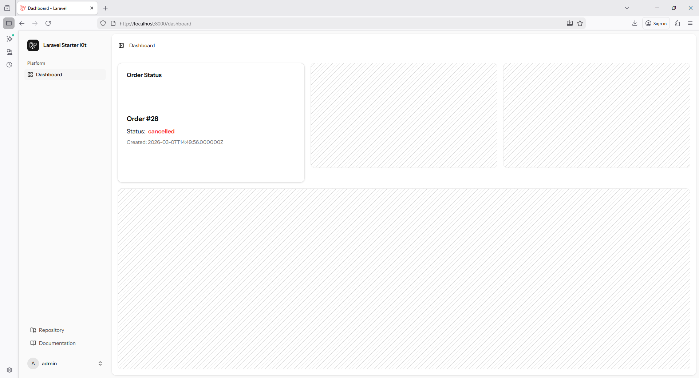

#  Stop Refreshing! Laravel useEcho Hooks for React & Vue 
```
https://www.youtube.com/watch?v=1hPRp6uLBA0
```

**Laravel Reverb + Event Broadcasting + Console Command** works correctly.

---

# Fixed README – Laravel Reverb Order Status Broadcasting

## 1. Install Broadcasting

```bash
php artisan install:broadcasting
```

Select:

```
reverb
```

If Node packages fail, install manually:

```bash
npm install --save-dev laravel-echo pusher-js @laravel/echo-react
npm run build
```

---

# 2. Start Reverb Server

Run the websocket server:

```bash
php artisan reverb:start
```

```bash
php artisan reverb:start --debug
```

Start Vite dev server:

```bash
npm run dev
```

Or using Composer script:

```bash
composer run dev
```

---

# 3. Create Event

```bash
php artisan make:event OrderStatusUpdated
```

```php
<?php

namespace App\Events;

use Illuminate\Broadcasting\Channel;
use Illuminate\Broadcasting\InteractsWithSockets;
use Illuminate\Broadcasting\PresenceChannel;
use Illuminate\Broadcasting\PrivateChannel;
use Illuminate\Contracts\Broadcasting\ShouldBroadcast;
use Illuminate\Foundation\Events\Dispatchable;
use Illuminate\Queue\SerializesModels;

use App\Models\Order;

use Illuminate\Contracts\Broadcasting\ShouldBroadcastNow;

class OrderStatusUpdated implements ShouldBroadcastNow
{
    use Dispatchable, InteractsWithSockets, SerializesModels;

    /**
     * Create a new event instance.
     */
    public function __construct(public Order $order)
    {
        //
    }

    /**
     * Get the channels the event should broadcast on.
     *
     * @return array<int, \Illuminate\Broadcasting\Channel>
     */
    public function broadcastOn(): array
    {
        return [            
            new PrivateChannel('orders'),
            // new Channel('orders')
        ];
    }

    public function broadcastAs(): string
    {        
        return 'OrderStatusUpdatedEvent';
    }

    public function broadcastWith(): array
    {
        return [
            'order' => $this->order
        ];
    }
}
```

---

# 4. Create Order Model

```bash
php artisan make:model Order -m
```

Model:

```php
<?php

namespace App\Models;

use Illuminate\Database\Eloquent\Factories\HasFactory;
use Illuminate\Database\Eloquent\Model;

class Order extends Model
{
    use HasFactory;

    protected $fillable = [
        'user_id',
        'status'
    ];

    public function user()
    {
        return $this->belongsTo(User::class);
    }
}
```

---

# 5. Migration Example

```php
Schema::create('orders', function (Blueprint $table) {
    $table->id();
    $table->foreignId('user_id')->constrained()->cascadeOnDelete();
    $table->string('status');
    $table->timestamps();
});
```

Run:

```bash
php artisan migrate
```

---

# 6. Create Factory

```bash
php artisan make:factory OrderFactory
```

Factory:

```php
<?php

namespace Database\Factories;

use Illuminate\Database\Eloquent\Factories\Factory;

use Illuminate\Support\Carbon;
use App\Models\User;
use App\Models\Order;

class OrderFactory extends Factory
{

    protected $model = Order::class;


    public function definition(): array
    {
        return [
            'status' => $this->faker->randomElement(['pending', 'processing', 'completed', 'cancelled']),
            'created_at' => Carbon::now(),
            'updated_at' => Carbon::now(),

            'user_id' => User::factory(),
        ];
    }
}
```

---

# 7. Create Console Command

```bash
php artisan make:command OrderStatusUpdate
```

Command:

```php
<?php

namespace App\Console\Commands;

use Illuminate\Console\Command;

use App\Models\Order;
use App\Events\OrderStatusUpdated;

class OrderStatusUpdate extends Command
{
    /**
     * The name and signature of the console command.
     *
     * @var string
     */
    protected $signature = 'app:order-status-update';

    /**
     * The console command description.
     *
     * @var string
     */
    protected $description = 'Command description';

    /**
     * Execute the console command.
     */
    public function handle()
    {
        $order = Order::factory()->create();

        event(new OrderStatusUpdated($order));

        $this->info("Order {$order->id} created and event broadcasted.");
    }
}
```

---

# 8. Run Command

```bash
php artisan app:order-status-update
```

This will:

1. Create fake order
2. Broadcast event
3. Send realtime update to frontend

---

# 9. `app.tsx`

`resources\js\app.tsx`


# 🔎 Why Your Output Shows `private-orders`

`@laravel/echo-react` sometimes auto-prefixes channels when the broadcaster config is wrong.

Your **Echo config might be missing options**.

Check your `configureEcho()`:

```ts
configureEcho({
    broadcaster: "reverb",
    wsHost: window.location.hostname,
    wsPort: 8080,
    forceTLS: false,
});
```

# 10. `routes\channels.php`


```php
<?php

use Illuminate\Support\Facades\Broadcast;

Broadcast::channel('App.Models.User.{id}', function ($user, $id) {
    return (int) $user->id === (int) $id;
});


// Broadcast::channel('orders', function () {
    // return auth()->check();
    // return true;
// });

Broadcast::channel('orders', function ($user) {
    return true;
});
```

# 11. Listen in React / Inertia Dashboard

Example:

`resources/js/pages/dashboard.tsx`

```javascript
import { Head } from '@inertiajs/react';
import { PlaceholderPattern } from '@/components/ui/placeholder-pattern';
import AppLayout from '@/layouts/app-layout';
import { dashboard } from '@/routes';
import type { BreadcrumbItem } from '@/types';
import { useEcho } from '@laravel/echo-react';
import { useState } from 'react';
import OrderStatus from '@/components/order-status';

const breadcrumbs: BreadcrumbItem[] = [
    {
        title: 'Dashboard',
        href: dashboard(),
    },
];

interface Order {
    id: number;
    user_id: number;
    status: string;
    created_at: string;
    updated_at: string;
}

export default function Dashboard() {

    const [order, setOrder] = useState<Order | null>(null);

    useEcho<{order: Order}>('orders', '.OrderStatusUpdatedEvent', (e) => {
        console.log(e.order.status);
        console.log("EVENT RECEIVED", e);
        setOrder(e.order);
    });

    return (
        <AppLayout breadcrumbs={breadcrumbs}>
            <Head title="Dashboard" />
            <div className="flex h-full flex-1 flex-col gap-4 overflow-x-auto rounded-xl p-4">
                <div className="grid auto-rows-min gap-4 md:grid-cols-3">
                    <OrderStatus order={order} />                    
                    <div className="relative aspect-video overflow-hidden rounded-xl border border-sidebar-border/70 dark:border-sidebar-border">
                        <PlaceholderPattern className="absolute inset-0 size-full stroke-neutral-900/20 dark:stroke-neutral-100/20" />
                    </div>
                    <div className="relative aspect-video overflow-hidden rounded-xl border border-sidebar-border/70 dark:border-sidebar-border">
                        <PlaceholderPattern className="absolute inset-0 size-full stroke-neutral-900/20 dark:stroke-neutral-100/20" />
                    </div>
                </div>
                <div className="relative min-h-[100vh] flex-1 overflow-hidden rounded-xl border border-sidebar-border/70 md:min-h-min dark:border-sidebar-border">
                    <PlaceholderPattern className="absolute inset-0 size-full stroke-neutral-900/20 dark:stroke-neutral-100/20" />
                </div>
            </div>
        </AppLayout>
    );
}
```
---

# 12. OrderStatus Component

Example:

`resources\js\components\order-status.tsx`

```javascript
import { Card, CardContent, CardHeader, CardTitle } from "@/components/ui/card";

interface Order {
    id: number;
    user_id: number;
    status: string;
    created_at: string;
    updated_at: string;
}

interface Props {
    order: Order | null;
}

export default function OrderStatus({ order }: Props) {

    const statusColor = (status: string) => {
        switch (status) {
            case "pending":
                return "text-yellow-500";
            case "processing":
                return "text-blue-500";
            case "completed":
                return "text-green-500";
            case "cancelled":
                return "text-red-500";
            default:
                return "text-gray-500";
        }
    };

    return (
        <Card className="aspect-video">
            <CardHeader>
                <CardTitle>Order Status</CardTitle>
            </CardHeader>

            <CardContent className="flex flex-col justify-center h-full">
                {!order ? (
                    <p className="text-muted-foreground">
                        Waiting for order updates...
                    </p>
                ) : (
                    <div className="space-y-2">
                        <p className="text-lg font-semibold">
                            Order #{order.id}
                        </p>

                        <p>
                            Status:
                            <span
                                className={`ml-2 font-bold ${statusColor(order.status)}`}
                            >
                                {order.status}
                            </span>
                        </p>

                        <p className="text-sm text-muted-foreground">
                            Created: {order.created_at}
                        </p>
                    </div>
                )}
            </CardContent>
        </Card>
    );
}
```

---

# 13. Run Everything

Start all services:

```
php artisan serve
php artisan reverb:start
npm run dev
php artisan queue:work
```

Then test:

```
php artisan app:order-status-update
```

# ✅ Now Restart Everything

Run these again:

### Terminal 1

```bash
php artisan reverb:start
```

### Terminal 2

```bash
composer run dev
```

### Terminal 3

```bash
php artisan queue:work
```

### Terminal 4

```bash
php artisan app:order-status-update
```

---

# ✅ Test Again

Run:

```bash
php artisan app:order-status-update
```



Now the dashboard should update.

You should see **realtime event in browser console**.

---

# Common Mistakes You Had

| Problem                   | Fix                  |
| ------------------------- | -------------------- |
| Event name typo           | `OrderStatusUpdated` |
| Missing `ShouldBroadcast` | Added                |
| Wrong channel             | `orders`             |
| Wrong event import        | Fixed                |
| Factory missing imports   | Fixed                |
| Carbon unnecessary        | Removed              |

---

If you want, I can also show a **FULL Production Reverb Example**:

* Live **Order Dashboard**
* **Realtime Order Table**
* **Toast Notifications**
* **React + Inertia + Laravel Reverb**

This is a **very powerful real-time dashboard architecture** used in modern Laravel apps.

