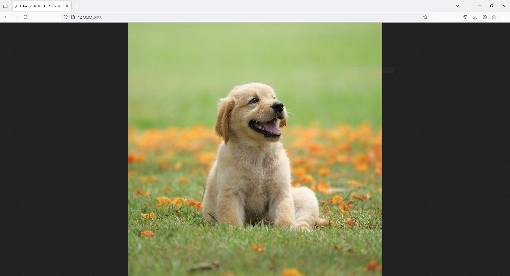

# 1 - `HomeController.php`

```php
<?php

namespace App\Http\Controllers;

use Illuminate\Http\Request;

use Imagick;
use ImagickDraw;
use ImagickPixel;
use Symfony\Component\HttpFoundation\Response;

class HomeController extends Controller
{    

    public function index()
    {
        $imagePath = public_path('dog.jpg');
        
        // Create an Imagick object
        $imagick = new Imagick($imagePath);

        // Output the image as a response
        header("Content-Type: image/jpeg");

        echo $imagick;
    }
    
}
```

```php
<?php

namespace App\Http\Controllers;

use Illuminate\Http\Request;

use Imagick;
use ImagickDraw;
use ImagickPixel;
use Symfony\Component\HttpFoundation\Response;

class HomeController extends Controller
{    

    public function index()
    {
        $imagePath = public_path('dog.jpg');
        
        // Create an Imagick object
        $imagick = new Imagick($imagePath);

        // Output the image as a response
        // Get the image blob
        $imageBlob = $imagick->getImageBlob();

        // Create a response with the image blob
        return response($imageBlob, 200)->header('Content-Type', 'image/png');
    }
    
}
```

