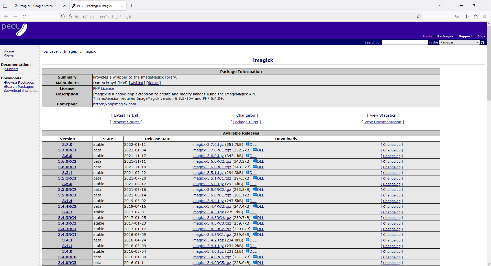
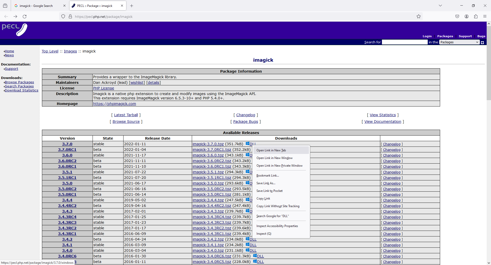
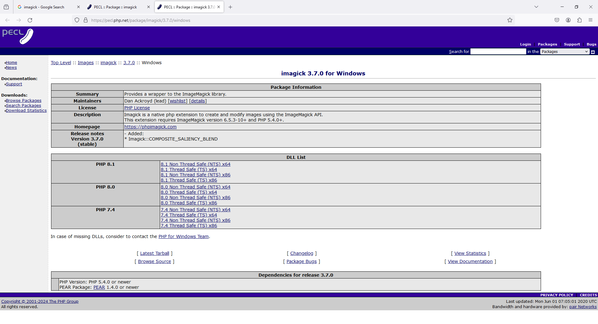
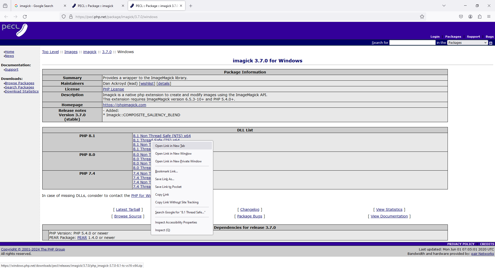
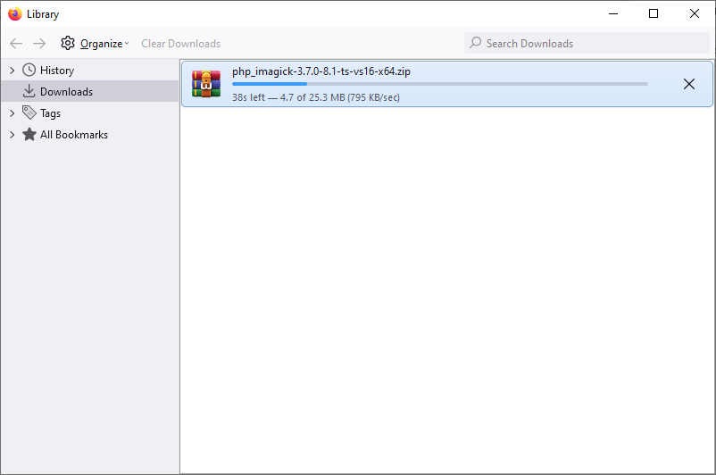
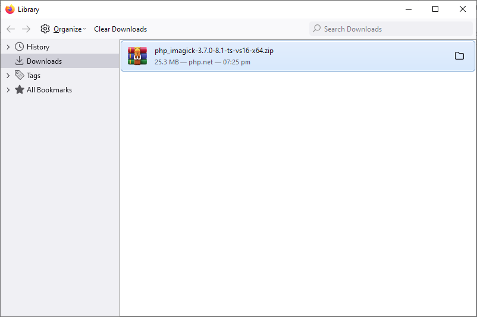
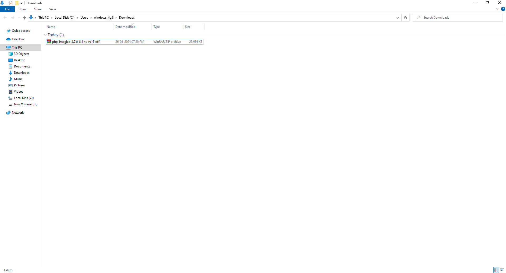
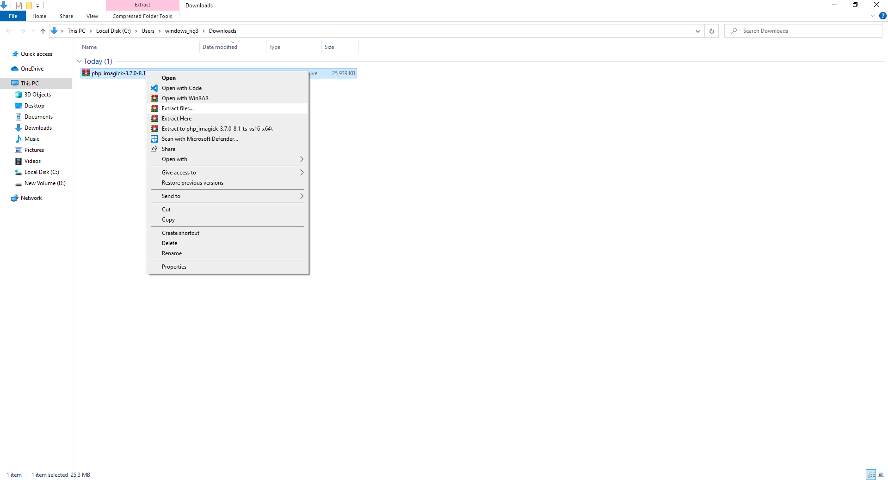
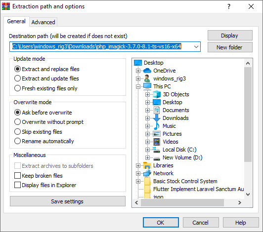
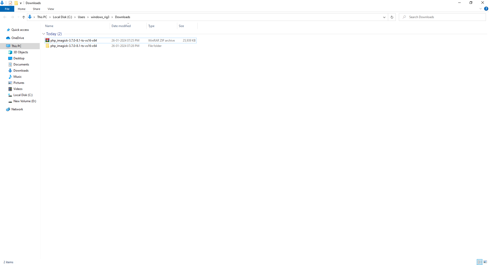
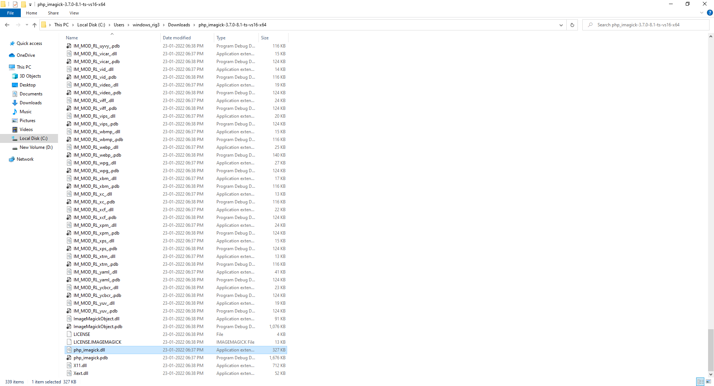
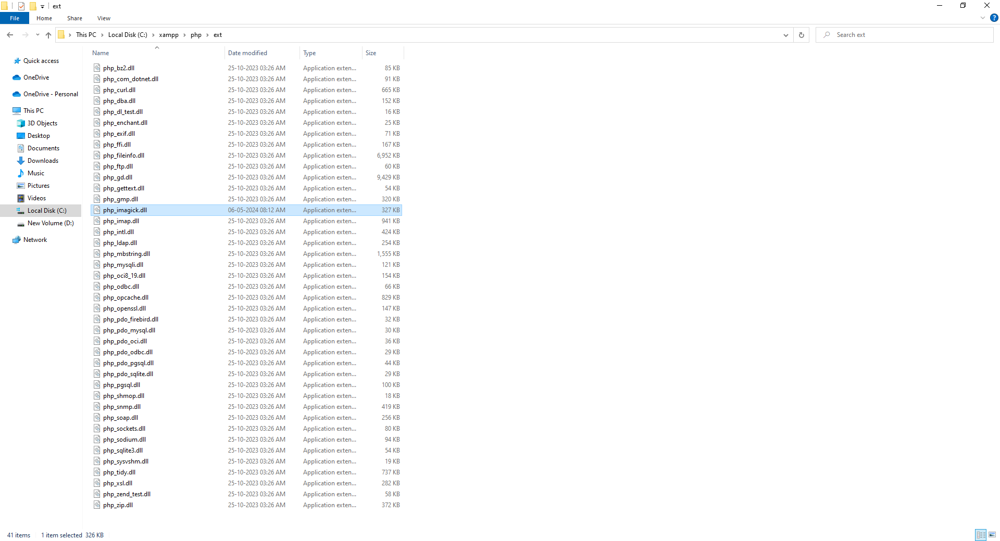

# 16 - Copy Paste php_imagick
Copy Paste php_imagick.dll
```
C:\xampp\php\ext\
```

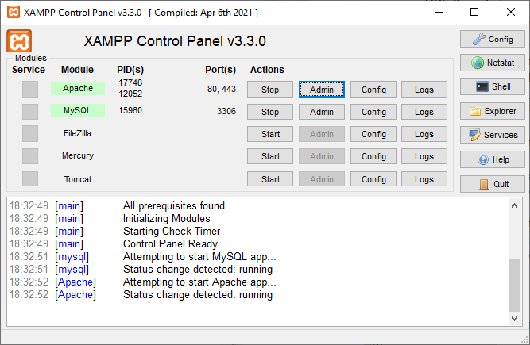

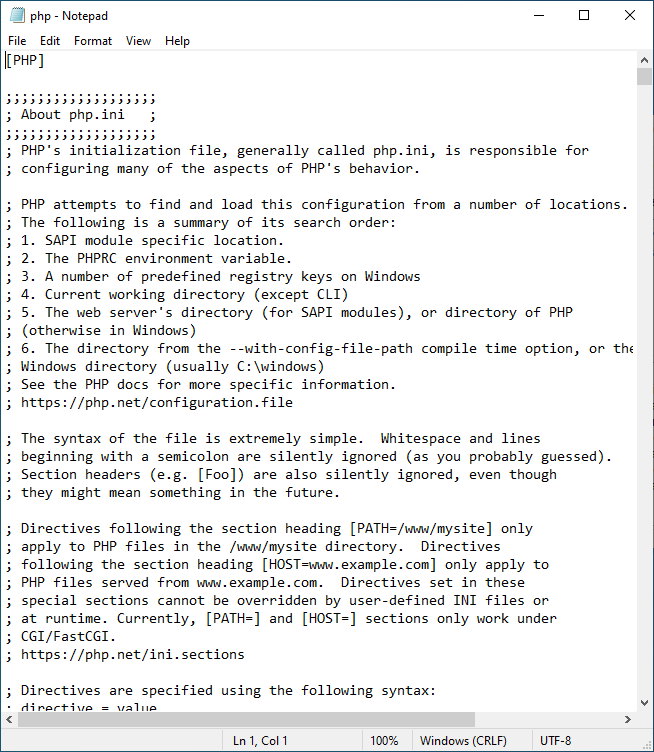
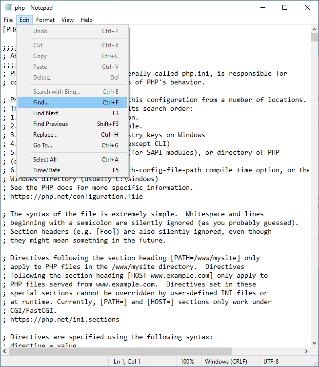
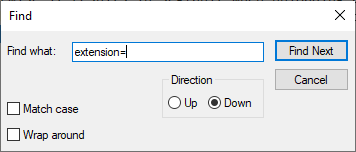
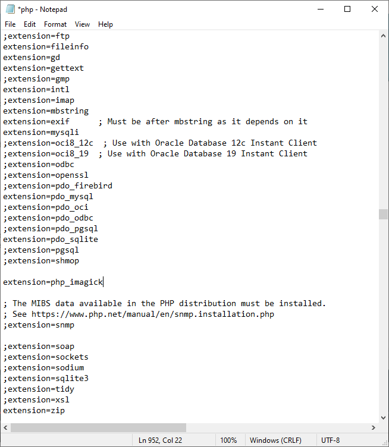

# 22 - add php_imagick extension into php.ini
```
extension=php_imagick
```

```
https://phpandmysql.com/extras/install-imagemagick-and-imagick-xampp/
```

```
https://pecl.php.net/package/imagick
```